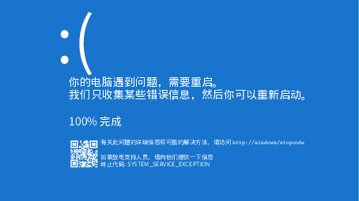

windows-crash-screenshot
========================

Can use it to spoof. 可以用它恶搞。

灵感来源于[bilibili]。提供源文件，可以自行修改后重新编译。比如你的大脑遇到问题。



Dependent
---------

1.  A LaTex distribution. Such as [texlive].

Install
-------

``` {.zsh}
git clone git@github.com:Freed-Wu/windows-crash-screenshot
cd windows-crash-screenshot
latexmk -pvc main.tex
```

Q & A
-----

More question see [Issues].

If you don't wanna compile, you can download the complied paper from
[Release]

  [bilibili]: https://www.bilibili.com/video/av54093083/
  [texlive]: https://github.com/TeX-Live/texlive-source
  [Issues]: https://github.com/Freed-Wu/windows-crash-screenshot/issues
  [Release]: https://github.com/Freed-Wu/windows-crash-screenshot/releases/
